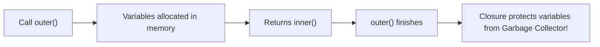

# JavaScript Closures: Finally Explained in Plain English (5-Min Read)

> *"A closure is when a function remembers the variables around it, even after its parent function has finished running."*

If closures have ever confused you, you're not alone. Most tutorials drown you in textbook jargon like *"lexical environments"* and *"execution context stacks."* 

Let's throw all that out the window. 

In just 5 minutes, we'll break down closures using the simple **What, When, Why, and Example** framework so you can finally understand them with zero headache.

---

## 1. What is a Closure?

Imagine a function is a traveler leaving home. 

When you define an inner function inside an outer function, the inner function doesn't leave empty-handed. It packs a **backpack** with all the variables from its parent that it needs.

```
+-------------------------------------------------------------+
|  outerFunction() runs and exits                             |
|                                                             |
|  innerFunction walks away holding its "Backpack" 🎒         |
|  Backpack contents: [ score, secretKey, username ]          |
|                                                             |
|  Whenever innerFunction runs later, it grabs from its bag! |
+-------------------------------------------------------------+
```

Normally, when a function finishes running, JavaScript deletes its variables to save memory. 

**A closure happens when an inner function keeps a reference to those outer variables.** Even if the outer function is completely done and gone, that backpack keeps the variables alive in memory.

---

## 2. When Should You Use Closures?

You probably use closures every day without realizing it. Here's when to reach for them—and when to skip them.

### When to use them:
- **Private Variables**: When you want state that nobody can mess with from the outside (no rogue scripts changing your values).
- **Function Factories (Currying)**: When you want to configure a function once (like setting a base discount rate or API URL) and reuse it.
- **Timers and Event Handlers**: When `setTimeout` or a click listener needs to remember data from the moment it was registered.
- **React Hooks**: Hooks like `useState` rely directly on closures to remember component state between re-renders!

### When NOT to use them:
- **Simple Functions**: If you just need to compute something once, pass parameters normally. Don't add nested functions just to look clever.
- **Heavy Loops with Tight Memory Limits**: Keeping too many variables in closure memory inside thousands of rapid loops can hurt performance.

---

## 3. Why Do Closures Matter?

### The Problem They Solve
Before modern JavaScript, if two functions needed to share a variable, you had to put it in the **global scope**. 

The result? Bugs everywhere. Any script could accidentally overwrite your variable. 

Closures solved this by providing **safe, private memory** without polluting the global window.



### The Quick Trade-offs

- **Why they're great**: Encapsulation (data privacy), cleaner modular code, persistent state.
- **The catch**: Variables referenced in closures aren't cleared by the garbage collector until the inner function is no longer reachable.

---

## 4. Examples (From Broken to Best Practice)

Let's look at two practical examples you'll see in real life.

### Example 1: The Classic Loop Trap (Interview Favorite)

Ever seen this frustrating bug?

```javascript
// ❌ Anti-pattern: 'var' shares one single variable across all timers
for (var i = 1; i <= 3; i++) {
  setTimeout(() => {
    console.log(`Count: ${i}`);
  }, 1000);
}

// Output after 1 second:
// Count: 4
// Count: 4
// Count: 4
```

**What happened?** `var` is not block-scoped. By the time the 1-second timer fired, the loop had already finished, and `i` was `4`.

Here is the one-word fix:

```javascript
// ✅ Recommended: Use 'let' for block-scoped closures
for (let i = 1; i <= 3; i++) {
  setTimeout(() => {
    console.log(`Count: ${i}`);
  }, 1000);
}

// Output after 1 second:
// Count: 1
// Count: 2
// Count: 3
```

Because `let` is block-scoped, JavaScript creates a fresh closure for **each iteration**. Each callback packs its own unique `i` into its backpack.

---

### Example 2: Building Private State (A Mini Bank Account)

Want to make sure no outside code can tamper with a balance? Closures make it effortless:

```javascript
// ❌ Anti-pattern: Public object properties (anyone can mutate this!)
const badAccount = { balance: 100 };
badAccount.balance = -99999; // 💥 Broke your app with zero validation
```

Now, check out the closure-powered version:

```javascript
// ✅ Recommended: Private state via closure encapsulation
function createAccount(initialBalance) {
  let balance = initialBalance; // 🔒 Protected inside the closure backpack

  return {
    deposit(amount) {
      if (amount <= 0) return "Amount must be positive";
      balance += amount;
      return `Balance: $${balance}`;
    },
    withdraw(amount) {
      if (amount > balance) return "Insufficient funds";
      balance -= amount;
      return `Balance: $${balance}`;
    },
    getBalance() {
      return `$${balance}`;
    }
  };
}

const myAccount = createAccount(100);

console.log(myAccount.deposit(50));   // "Balance: $150"
console.log(myAccount.withdraw(30));  // "Balance: $120"
console.log(myAccount.getBalance());  // "$120"

// Try to cheat and change balance directly:
console.log(myAccount.balance);       // undefined (Completely protected!)
```

---

## 5-Second Cheat Sheet

| Question | Short Answer |
| :--- | :--- |
| **What is it?** | A function carrying its outer variables in a "backpack". |
| **When to use it?** | For private variables, function factories, timers, and React hooks. |
| **Why use it?** | Keeps state safe without polluting global variables. |
| **Common trap?** | Using `var` instead of `let` in asynchronous loops. |

---

## Takeaway

Closures aren't magic—they're just JavaScript functions remembering where they came from. Keep the backpack analogy in mind, and you'll write cleaner, safer, and more modular code every single day.
